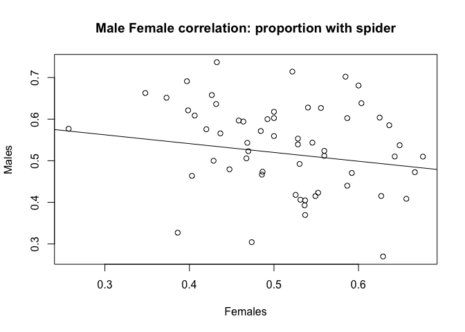
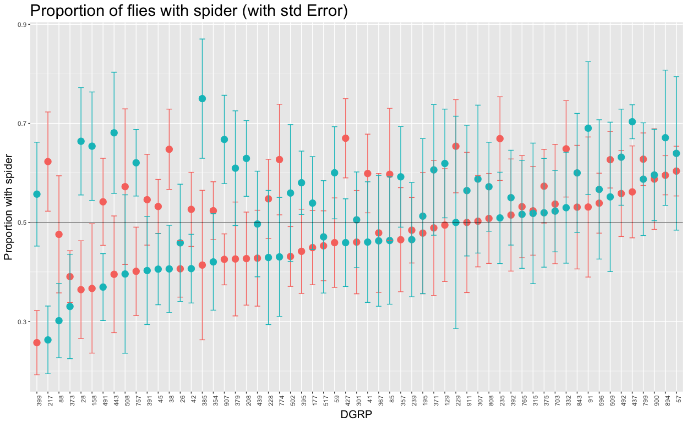
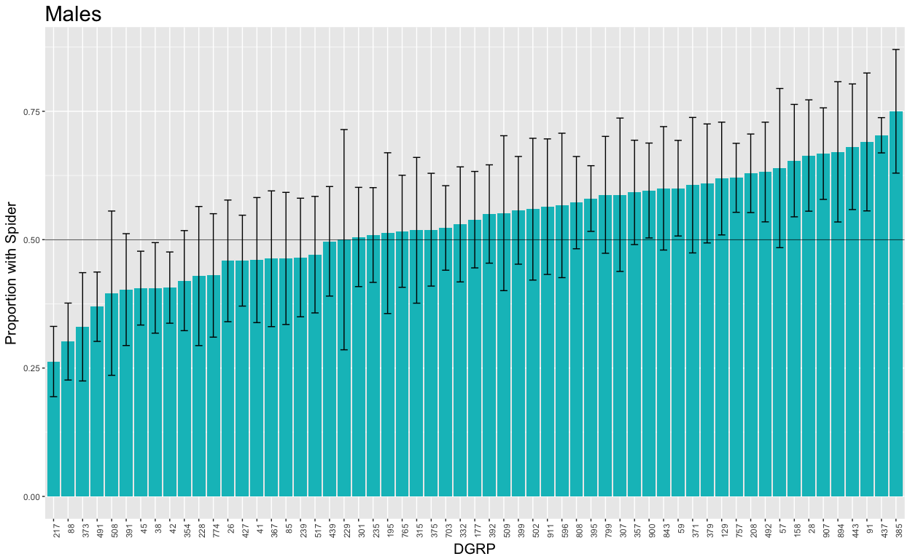
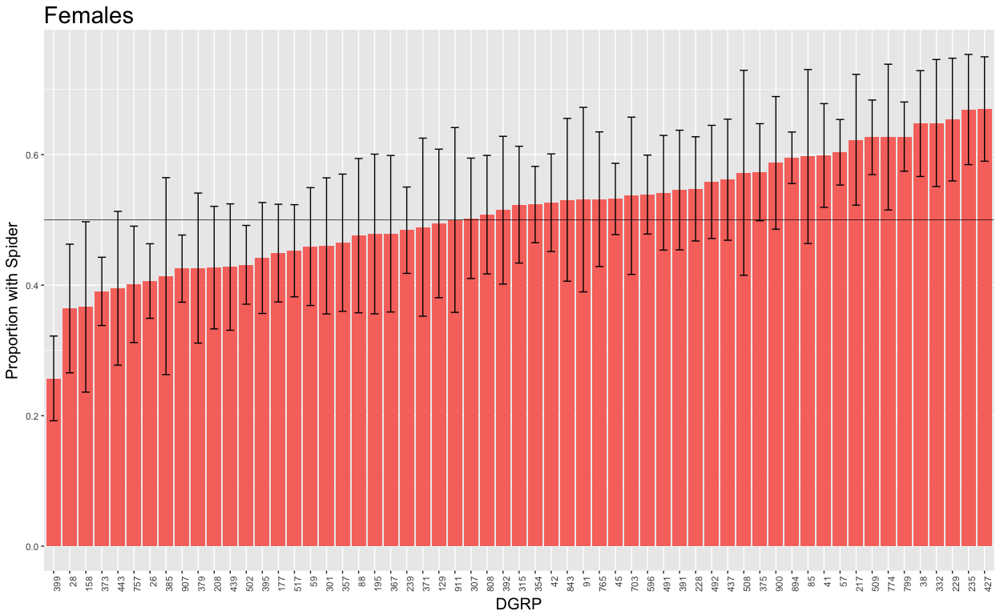
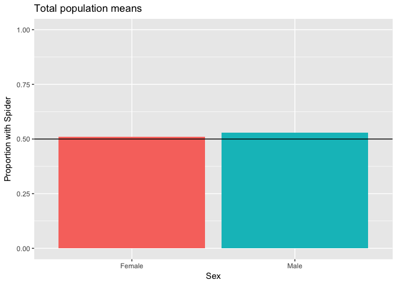

Perception R Code
================

How do different DGRP dihybrid lines vary in their ability to perceive and avoid predator cues?
-----------------------------------------------------------------------------------------------

### Hypothesis:

DGRP dihybrids will show significant genetic variation in ability to percieve predator cues.

### Prediction:

Each DGRP dihybrid lines will show within line consistancy, but display between line variability in the proportion within a spider vial, ranging from very low (~ 0%, avoiding spider cues) to a random assortment (~50%, randomly assortment, not recognizing spider cues).

### What I still want done:

1.  More precise statistics (Bio 708)
2.  Correlation to aggression, activity and sociability
3.  Increase sample size for some (or all) lines
4.  Reanalyze some very high and low lines or with evolved populations

### Notes on protocol and results

-   10 sets of data collection, 7 days of which have all lines completed at once, first 3 days with random subset of lines (\*both sexes done on same day)

-   Dihybrid flies aged 4-5 days, with opportunities to mate before experiment start

-   10 flies of same sex into bin with two snap cap vials, one with spider, one without spider

-   count number of flies in each vial after 24 and 48 hours

-   removed all those with &lt; 6 flies in both vials (spider vial + not spider vial &gt;= 6)

-   all results below for 48 hour counts

### Sex Correlation:

    ## [1] -0.2526972



### Sample sizes:

Males

    ##  26  28  38  41  42  45  57  59  85  88  91 129 158 177 195 208 217 228 
    ##   7   9  10   8  10   9   5  13   7   7   7   7   7  13   7  11   7   8 
    ## 229 235 239 301 307 315 332 354 357 367 371 373 375 379 385 391 392 395 
    ##   5  11   8   9   8   7   7   7   7   8   7  11   9   7   6   6   6  11 
    ## 399 427 437 439 443 491 492 502 508 509 517 596 703 757 765 774 799 808 
    ##   6  10   5   8   7  10   7   8   6   6   8   5   9  14  10   7   9   7 
    ## 843 894 900 907 911 
    ##   9   6   9   9   7

Females

    ##  26  28  38  41  42  45  57  59  85  88  91 129 158 177 195 208 217 228 
    ##   7  10  11   8  10  10   6  13   8   6   5   8   7  13   7  10   7   7 
    ## 229 235 239 301 307 315 332 354 357 367 371 373 375 379 385 391 392 395 
    ##   8  11   8  10  10   7   8   8   7   9   7  11   9   7   4   8   6  11 
    ## 399 427 437 439 443 491 492 502 508 509 517 596 703 757 765 774 799 808 
    ##   7  10   7   8   7  10   7   8   6   5   8   6   9  14  11   7  10   8 
    ## 843 894 900 907 911 
    ##   9   6   8   7   7

### Plots









### Models:

``` r
mod1 <- glmer(cbind(Not_spider, Spider) ~ 1 + Sex + Temp_Scaled + Humidity_Scaled + BP_Scaled + (1|Date) 
              + (0 + Sex|DGRP), data = DGRP_by_counts, family = "binomial")
summary(mod1)
```

    ## Generalized linear mixed model fit by maximum likelihood (Laplace
    ##   Approximation) [glmerMod]
    ##  Family: binomial  ( logit )
    ## Formula: 
    ## cbind(Not_spider, Spider) ~ 1 + Sex + Temp_Scaled + Humidity_Scaled +  
    ##     BP_Scaled + (1 | Date) + (0 + Sex | DGRP)
    ##    Data: DGRP_by_counts
    ## 
    ##      AIC      BIC   logLik deviance df.resid 
    ##   5529.6   5573.4  -2755.8   5511.6      952 
    ## 
    ## Scaled residuals: 
    ##     Min      1Q  Median      3Q     Max 
    ## -3.7429 -1.3765 -0.0709  1.3610  3.9393 
    ## 
    ## Random effects:
    ##  Groups Name        Variance Std.Dev. Corr 
    ##  DGRP   SexFemale   0.08134  0.2852        
    ##         SexMale     0.12811  0.3579   -0.36
    ##  Date   (Intercept) 0.01503  0.1226        
    ## Number of obs: 961, groups:  DGRP, 59; Date, 10
    ## 
    ## Fixed effects:
    ##                 Estimate Std. Error z value Pr(>|z|)
    ## (Intercept)     -0.05143    0.06281  -0.819    0.413
    ## SexMale         -0.08390    0.08200  -1.023    0.306
    ## Temp_Scaled      0.02346    0.05024   0.467    0.641
    ## Humidity_Scaled -0.04285    0.04073  -1.052    0.293
    ## BP_Scaled       -0.02524    0.04675  -0.540    0.589
    ## 
    ## Correlation of Fixed Effects:
    ##             (Intr) SexMal Tmp_Sc Hmdt_S
    ## SexMale     -0.571                     
    ## Temp_Scaled  0.052  0.001              
    ## Humdty_Scld -0.104  0.003 -0.298       
    ## BP_Scaled   -0.016  0.002  0.387 -0.113

``` r
mod2 <- lmer(proportion_spider ~ 1 + Sex + Temp_Scaled + Humidity_Scaled + BP_Scaled + (1|Date) 
             + (0 + Sex|DGRP), data = DGRP_by_counts)

summary(mod2)
```

    ## Linear mixed model fit by REML ['lmerMod']
    ## Formula: proportion_spider ~ 1 + Sex + Temp_Scaled + Humidity_Scaled +  
    ##     BP_Scaled + (1 | Date) + (0 + Sex | DGRP)
    ##    Data: DGRP_by_counts
    ## 
    ## REML criterion at convergence: 378.1
    ## 
    ## Scaled residuals: 
    ##      Min       1Q   Median       3Q      Max 
    ## -1.94967 -0.80687  0.02671  0.81983  1.81641 
    ## 
    ## Random effects:
    ##  Groups   Name        Variance  Std.Dev. Corr 
    ##  DGRP     SexFemale   0.0006416 0.02533       
    ##           SexMale     0.0013953 0.03735  -1.00
    ##  Date     (Intercept) 0.0009796 0.03130       
    ##  Residual             0.0827132 0.28760       
    ## Number of obs: 961, groups:  DGRP, 59; Date, 10
    ## 
    ## Fixed effects:
    ##                  Estimate Std. Error t value
    ## (Intercept)      0.510876   0.016951  30.138
    ## SexMale          0.017644   0.020354   0.867
    ## Temp_Scaled     -0.004534   0.015169  -0.299
    ## Humidity_Scaled  0.011099   0.012961   0.856
    ## BP_Scaled        0.003919   0.014397   0.272
    ## 
    ## Correlation of Fixed Effects:
    ##             (Intr) SexMal Tmp_Sc Hmdt_S
    ## SexMale     -0.574                     
    ## Temp_Scaled  0.051  0.000              
    ## Humdty_Scld -0.084  0.004 -0.296       
    ## BP_Scaled   -0.006  0.001  0.372 -0.153
